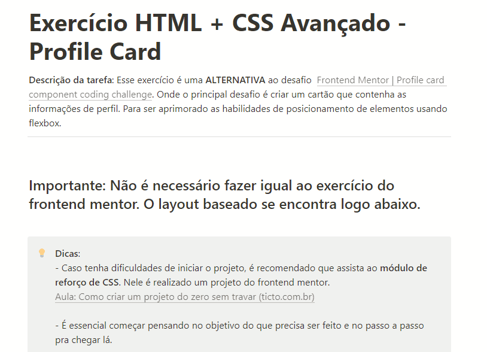

# Profile Card
Exercício do curso DevQuest para praticar conceitos de Flexbox com CSS.

 

## Tecnologias utilizadas:
- HTML
- CSS

 

## Descrição do exercício:

{:target="_blank" rel="noopener"}

 

## Dificuldades:

- Tive dificuldade no início para centralizar o card, mas com muito esforço consegui o resultado mais próximo do final que consegui.
- Inicialmente fiz o card com as dimensões erradas, 300x350.
- Estava com dificuldade de adicionar a tag hr no card, pois no documento reset.css eu havia definido a border como zero. Depois de muito procurar consegui solucionar

 

## Aprendizado:

- Estudei bastante sobre flexbox e pensava que seria bem fácil trabalhar com a propriedade, mas pelas dificuldades que passei no exercício aprendi que tem sempre algo novo para acrescentar.
- Como identificar os erros do projeto e solucionar eles. 
- A importância de utilizar boas ferramentas auxiliares, como por exemplo o Figma, para que o projeto seja mais preciso possível.

## Visualização do projeto final:

https://john-dalton-27.github.io/profile-card/

 

### Créditos:
Exercício criado por <a href="https://www.frontendmentor.io/challenges/profile-card-component-cfArpWshJ" target="_blank">Front-end mentor</a>,
reformulado e simplificado por <a href="https://github.com/devemdobro/devemdobro" target="_blank">Dev em dobro</a>,
reproduzido por John Dalton.
